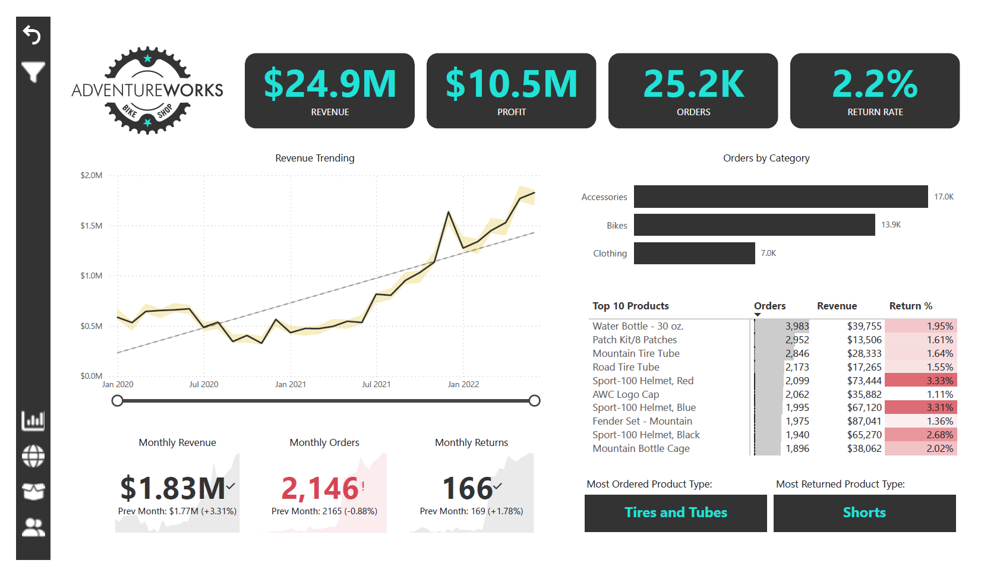
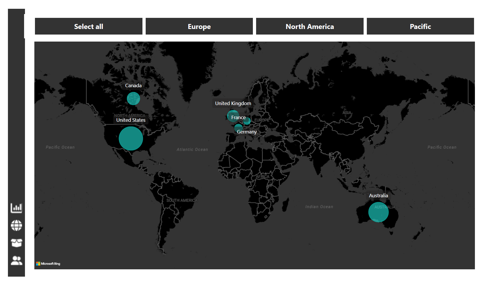
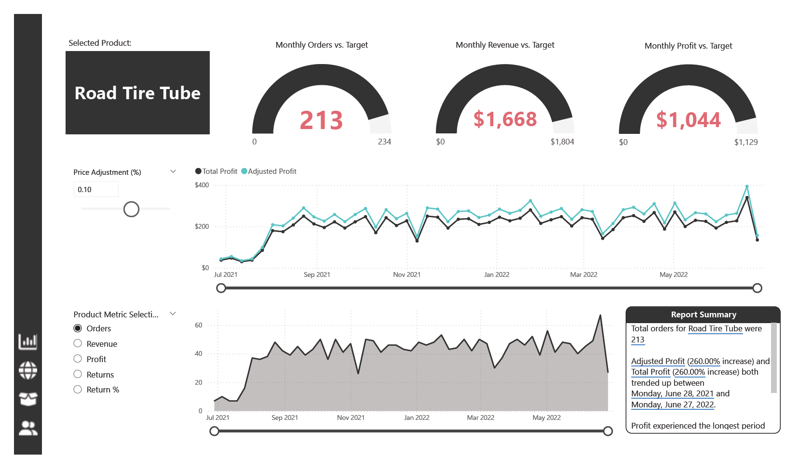
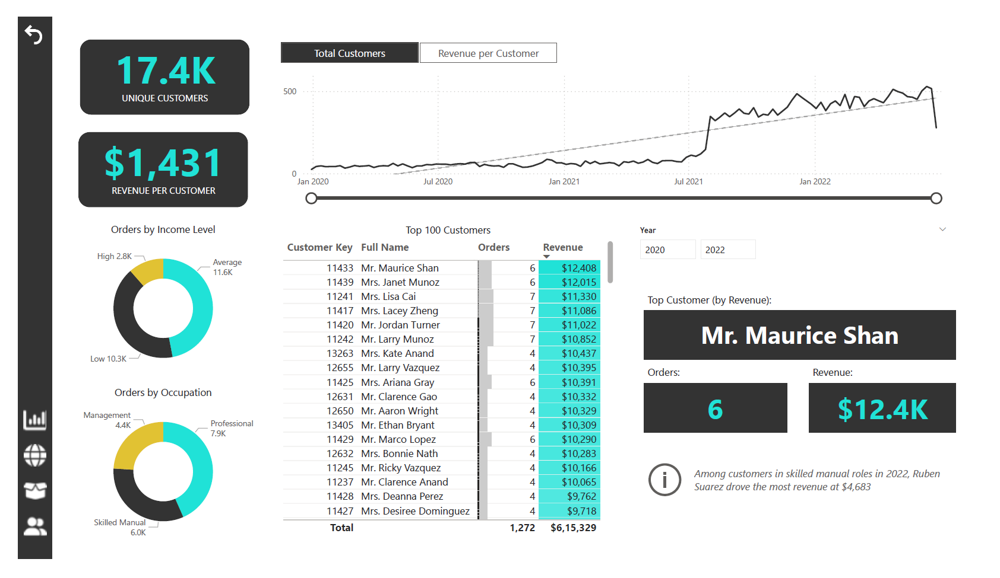

# Power BI Dashboard Project - AdventureWorks

## Overview

This repository contains a Power BI dashboard created for AdventureWorks, a fictional company specializing in cycling-related products. The dashboard provides key insights into revenue, profit, orders, and product performance over time, with a focus on geographic distribution and product-level details.

## Dashboard Highlights

### 1. **Executive Dashboard**:

   - **Key Metrics**:
     - **Revenue**: $24.9M
     - **Profit**: $10.5M
     - **Orders**: 25.2K
     - **Return Rate**: 2.2%
   - **Revenue Trend**: The revenue trend chart shows a steady increase from January 2020 to the 2022, with revenue growing from approximately $0.5M to over $1.5M monthly.
   - **Monthly Performance**:
     - **Revenue**: $1.83M (+3.31% compared to the previous month)
     - **Orders**: 2,146 (-0.88% compared to the previous month)
     - **Returns**: 166 (+1.78% compared to the previous month)
   - **Orders by Category**: Accessories (17.0K), Bikes (13.9K), Clothing (7.0K)
   - **Top 10 Products**: 
     - The water bottle, patch kits, and mountain tire tube are the most ordered items.
     - Products like the Sport-100 helmet have higher return rates, with some as high as 3.33%.
   - **Product Insights**:
     - **Most Ordered Product Type**: Tires and Tubes
     - **Most Returned Product Type**: Shorts

### 2. **Geographic Map**:

   - The map visual shows the geographic distribution of sales, with key regions including:
     - **United States**: Largest sales volume
     - **Canada**, **France**, **Germany**, **United Kingdom**, and **Australia**: Significant but smaller sales volumes
   - The map allows filtering by region, such as Europe, North America, and the Pacific, to provide insights into regional performance.

### 3. **Product Detail Dashboard**:

   - **Selected Product**: Road Tire Tube
   - **Monthly Orders vs. Target**: 213 orders, slightly below the target of 234.
   - **Monthly Revenue vs. Target**: $1,668, below the target of $1,804.
   - **Monthly Profit vs. Target**: $1,044, just below the target of $1,129.
   - **Price Adjustment**: The dashboard allows for price adjustment simulation, showing how profits and revenues are impacted by percentage adjustments.
   - **Profit Analysis**:
     - The trend graph shows both total and adjusted profits. There is a steady increase in profit from July 2021 through mid-2022, with a minor decline in June 2022.
     - Adjusted profit has shown a significant 260% increase between June 28, 2021, and June 27, 2022, indicating a positive trajectory for the selected product.

### 4. **Customer Detail Dashboard**:

   - **Customer Metrics**:
     - **Unique Customers**: 17.4K
     - **Revenue Per Customer**: $1,431
   - **Orders by Income Level**:
     - A breakdown of orders shows that most orders come from the low-income group (10.3K), while high-income customers contribute 2.8K orders.
   - **Orders by Occupation**:
     - Customers are classified by occupation: Management (4.4K orders), Professional (7.9K orders), and Skilled Manual (6.0K orders).
   - **Top Customers**:
     - **Top Customer by Revenue**: Mr. Maurice Shan, with 6 orders and a total revenue of $12.4K.
     - Among skilled manual workers, **Ruben Suarez** generated the most revenue ($4,683) in 2022.
   - **Top 100 Customers**: This table provides insights into the top customers based on orders and revenue, with Mr. Maurice Shan leading in revenue generation.
"""
## Features

- **Interactive Visualization**: Users can filter by product categories and regions to see focused data insights.
- **Revenue Trends**: Shows a timeline of revenue growth, helping to visualize business growth patterns.
- **Product Returns**: The return rate helps in understanding product performance and customer satisfaction.
